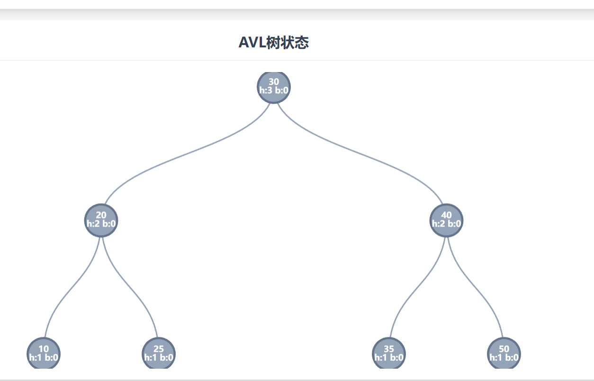

## AVL树

##### 一.平衡因子

1. BalanceFactor(node) = Height(node.left) - Height(node.right)

2. BF = 1(平衡因子)

   BF = 0

   BF = -1

##### 二. 高度 Height

1. 树的高度  height of a tree: 根节点的高度 

2. 节点的高度 height of a node: 从该节点到其最远叶子节点的路径上所包含的边的数量或节点的数量

3. 计算一个非叶子节点的高度：

   **Height(n) = 1 + max(height(N.leftchild), height(N.rightChild)))**

   一个叶子节点的高度，等于其所有子树中最高高度+1，max函数是取其左、右子树高度的最大值。

4. 高度的定义从 **0** 开始定义

   1. 空节点 NULL 高度为 -1
   2. 叶子节点高度为 0
   3. 计算公式**Height(n) = 1 + max(height(N.leftchild), height(N.rightChild)))**

5. 高度从 **1** 开始定义

   1. 空节点高度为 0
   2. 叶子节点高度为 1 
   3. 计算公式**Height(n) = 1 + max(height(N.leftchild), height(N.rightChild)))**

##### 三. 深度 Depth

> **高度：自底向上看，一个节点的高度是它到最远叶子节点的距离**
>
> **深度：自顶向下看，一个节点的深度是它到根节点的距离**

1. **深度的计算**
   1. 根节点的深度是 **0**
   2. 一个节点的深度 = 其父节点的深度 + 1

##### 四. 实测

| 节点值 | 高度 | 深度 | note                         |
| :----- | :--- | :--- | :--------------------------- |
| 30     | 3    | 0    | 根节点，深度越小，高度越大 |
| 20     | 2    | 1    |                              |
| 10     | 1    | 2    |                              |

1. 树的深度 = 树的高度 - 1 (如果高度从1开始计数，所以Tree的深度是2)
2. 对于任何一颗树，根节点的深度最小为 0 ，而其高度则最大
3. 叶子节点的深度最大，高度最少，为 0 或 1（取决于你的定义）
